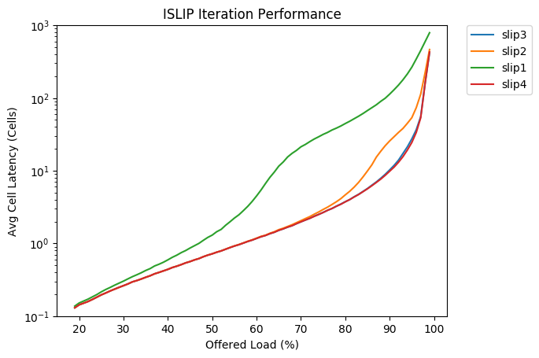
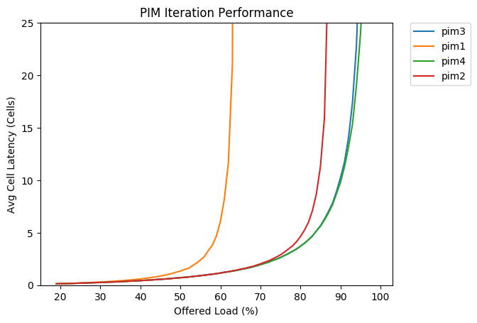

# Reproducing Switch Scheduling Research
Our project focuses on reproducing research related to switch scheduling. 
In particular, we focus on algorithms for input-queued switches that offer
solutions for the head-of-line blocking problem switch scheduling algorithms
contend with.

The main algorithm that we reproduce is the iSLIP algorithm but we also
reproduce

## Setting Up and Installing Dependencies
To get started with reproducing our project we recommend using an Ubuntu
16.04 LTS machine. You will need a single directory to install several
repos into so we recommend making a directory off your home directory 
(or wherever you choose) and then cloning this repo and the sim repo
into it. 

```
$ cd new_dir  # your new dir
$ git clone git@github.com:lanhamt/switch-scheduling.git
$ git clone sim
$ cd sim/src
$ make
$ cd ../..  # should be back in new_dir
```

## Running the Simulator
We have a convenient `run.sh` script in this repo that will create the
graphs that were the focus of our reproduction. Note that the simulator
takes a while to run - you should expect about 30 minutes depending on 
your machine. 

`run.sh` will produce the following graphs in the `graphs` directory and
should be similar to the ones below:

- `fig5.png` - a comparison of 4 different scheduing algorithms including iSLIP
- `islips.png` - a comparison of iSLIP with different iteration counts
- `islipslog.png` - the same as above but with a log scale
- `pims.png` - a comparison of PIM with different iteration counts
- `pimslog.png` - the same as above but with a log scale

### Simulation Images



## Tour of the Repo

- `scrips/` holds scripts for generating config files and graphing test results
- `master_configs/` holds templates that are used to generate custom sim config files


